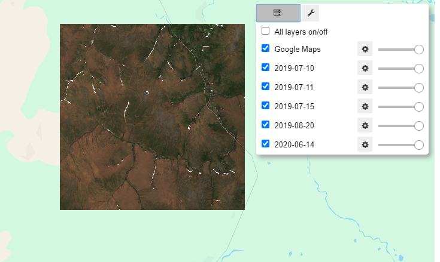

# aoi-2-dataset

`aoi-2-dataset.ipynb` demonstrates how to search within an area of interest (AOI) in Google Earth Engine for topographic and multispectral data in the Arctic, download that data, and convert it to a format that can be used to create labels and training data for image segmentation via [Doodleverse](https://github.com/Doodleverse) tools. For now this includes functions but in the future this tool may take the form of a package or functions/methods within a package. But for now you can run this notebook to collect your own data. Stay tuned!

Area of interest (AOI) can be (1) arbitrary buffer around a lat long, (2) an EE-hosted geometry or Feature, or (3) a shapefile etc of your own that can be converted to an EE feature. 

The "dataset" can be anything you want - right now the notebook shows RGB, NDVI, and elevation, but any raster data hosted on Earth Engine can be queried and downloaded. 

# To do list:
Short term:
- Perform the alignment and tiling for each day of imagery within separate directories (currently all dates would be dumped into the same directory)
- Save stack as a `.nc` file via `xarray`

Long term:
- Basically moving to AOIs outside the Arctic. Right now Sentinel 2 is the best imagery for the Arctic but you can imagine bringing in Landsat (coarser res but longer temporal range) or NAIP imagery (infrequent but high-res for CONUS) for other applications. Thus the relevant elevation data (USGS NED, SRTM, etc) would adapt based on location of AOI. 

